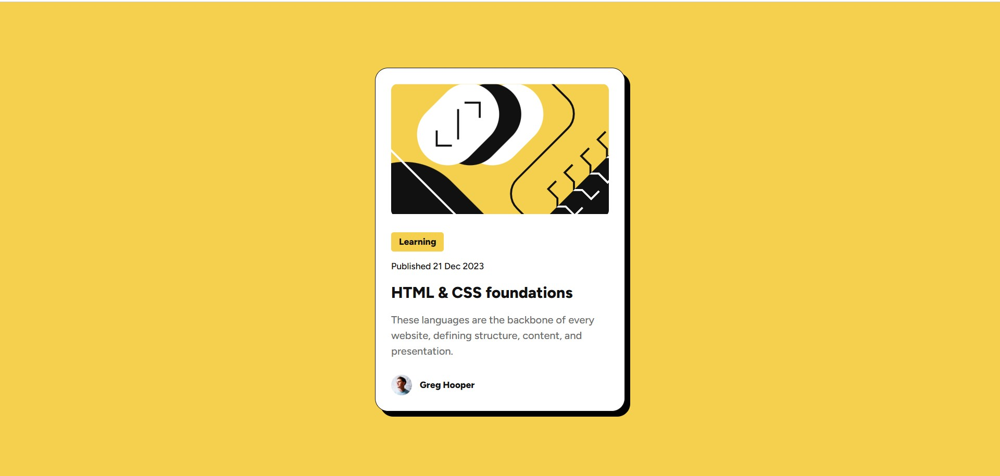

# Frontend Mentor - Blog preview card solution

This is a solution to the [Blog preview card challenge on Frontend Mentor](https://www.frontendmentor.io/challenges/blog-preview-card-ckPaj01IcS). Frontend Mentor challenges help you improve your coding skills by building realistic projects.

## Table of contents

- [Overview](#overview)
    - [The challenge](#the-challenge)
    - [Screenshot](#screenshot)
    - [Links](#links)
- [My process](#my-process)
    - [Built with](#built-with)
    - [What I learned](#what-i-learned)
    - [Continued development](#continued-development)
- [Author](#author)
- [Acknowledgments](#acknowledgments)

## Overview

### The challenge

Users should be able to:

- See hover and focus states for all interactive elements on the page

### Screenshot

### Links

- Solution URL: [https://github.com/async-kita/blog-preview-card](https://github.com/async-kita/blog-preview-card)
- Live Site URL: [https://async-kita.github.io/blog-preview-card/](https://async-kita.github.io/blog-preview-card/)

## My process

### Built with

- Semantic HTML5 markup
- CSS custom properties (design tokens)
- Flexbox for centering and layout
- BEM methodology for class naming
- Mobile-first approach with `clamp()` for fluid typography (no media queries needed)
- Local `@font-face` hosting for Figtree (Medium & ExtraBold)
- Accessibility improvements: `:focus-visible` outlines, `alt` text, `time` with `datetime`
- `@media (hover: hover)` to avoid sticky hover on touch devices

### What I learned

This project reinforced the importance of a solid HTML structure before writing CSS. Using a `<time>` element with a machine-readable `datetime` attribute felt particularly satisfying. I also experimented with `clamp()` to create responsive text that scales seamlessly between mobile and desktop without extra breakpoints. Styling `:focus-visible` separately helped keep keyboard navigation clean and intentional.

### Continued development

I’d like to explore more advanced hover effects (e.g., smoothly lifting the shadow or scaling the card) and perhaps turn this into a fully functional blog template using a static site generator. Adding subtle animations on load could also enhance perceived performance.

## Author

- GitHub - [@async-kita](https://github.com/async-kita)
- Frontend Mentor - [@yourusername](https://www.frontendmentor.io/profile/yourusername) *(update with your profile if you have one)*

## Acknowledgments

Thanks to the Frontend Mentor community for the detailed style guide and design files. The original challenge assets (designs, fonts, images) were provided by Frontend Mentor.